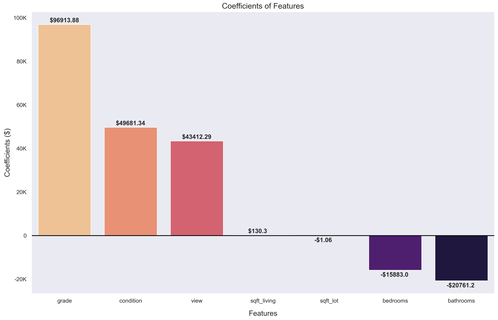
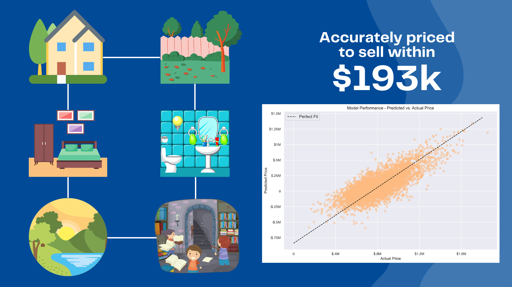

# King County Home Sales
**Authors:** [Jerry Vasquez](https://www.linkedin.com/in/jerry-vasquez-832b71224/), [Paul Lindquist](https://www.linkedin.com/in/paul-lindquist/), [Vu Brown](https://www.linkedin.com/in/austin-brown-b5211384/)

## Overview
***
This project assumes that we work for a real estate company in King County, Washington. We're tasked with providing data-driven recommendations for buying and selling homes.

## Business Problem
***
The company wants recommendations for customers looking to buy a home and for customers looking to sell their home.

As such, recommendations will be divided into 2 categories: buying homes and selling homes.

Buying homes:
- Use housing data (comps) of recently sold homes to create an inferential model
    - Model will be built using linear regression and selected variables (features) that best work with the target (price)
- Use the inferential model to assess what houses are underpriced or overpriced for customers looking to buy a home

Selling homes:
- Build a predictive model using comps of recently sold homes
    - Model will also be built using linear regression but use a more wholistic approach with features that could possibly add additional value
- Use the predictive model to recommend what price should be assigned to homes that will be sold by the company

## Data
***
This project uses the King County House Sales dataset, which can be found [here](https://www.kaggle.com/harlfoxem/housesalesprediction).

## Methods
***
We'll conduct descriptive analysis, linear regression and modeling (inferential, predictive).

## Results
***
These are home prices across King County that comprise 99.7% (3 standard deviations) of our dataset. The more expensive houses tend to have a view/waterfront. We can also see a cluster of higher-priced homes centered around western Bellevue and Mercer Island.


These are the coefficients of the features we used in our final inferential model. The negative values for bedrooms, bathrooms and lot size are indicative of the challenges our models encountered with the dataset.



Running our predictive model built on 12 home features, we're able to predict what price point should be used when selling a customer's house. Given the high price variance, it's not recommended to solely use our predictive model in determining price.



## Conclusions
***
Given the provided dataset and linear regression approach, both our inferential and predictive models did not perform as well as we had hoped.
- For the inferential model, homoscedasticity was poor, multicollinearity (VIF) was too high and the RMSE range was north of \$173k+. Linearity and normality performed decently.
- For the predictive model, multicollinearity (VIF) was too high for several features, the model score was an underwhelming .601629 and the RMSE range of \$193k+ was too great to provide any predictive value. Linearity and homoscedasticity were decent and normality was excellent, due to normalizing the data in pre-processing.

We recommend not using our models for predictive purposes and perhaps looking into a different dataset and/or different modeling approaches other than linear regression.

## For More Information
***
Please review our full analysis in our [Jupyter Notebook](./main_notebook.ipynb) or [presentation deck](./project_Presentation.pdf).

For additional questions, please contact [Jerry](mailto:jerryvas21@gmail.com), [Paul](mailto:paullindquist@fastmail.com) or [Vu](mailto:avbrown313@gmail.com).

## Repository Structure
***
```
├── README.md                           <- The top-level README for reviewers of this project
├── main_notebook.ipynb                 <- Narrative documentation of analysis in Jupyter notebook
├── project_presentation.pdf            <- PDF version of project presentation
├── data                                <- Both sourced externally and generated from code
└── images                              <- Both sourced externally and generated from code
```
